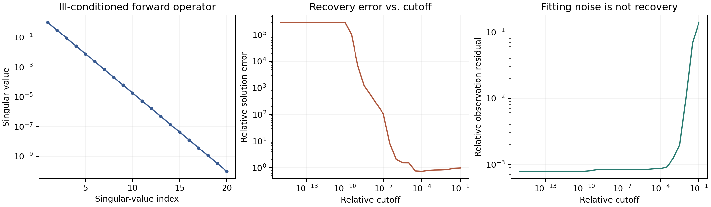

# Singular Value Decomposition and the Moore–Penrose Pseudoinverse

A numerical linear-algebra lab with a tested SVD pseudoinverse and a repeatable
inverse-problem experiment: **fitting noisy measurements closely does not mean
recovering the right signal**.



## Reproduce the results

Python 3.9–3.12; CPU only; no external data or credentials:

```bash
git clone https://github.com/takakhoo/svd-pseudoinverse-lab.git
cd svd-pseudoinverse-lab
python -m venv .venv
source .venv/bin/activate  # Windows: .venv\Scripts\activate
python -m pip install -r requirements-reproduce.txt
python -m unittest -v
python svd_lab.py --seed 7 --output results
```

The command regenerates the figure and [machine-readable metrics](results/metrics.json).
CI repeats the tests and experiment and publishes the generated artifacts.

## Measured experiment

A seeded synthetic `60 × 20` linear inverse problem has condition number
`10^10`, known ground truth, and additive Gaussian observation noise with
standard deviation `10^-4`. Everything except the singular-value cutoff is held fixed.

| Relative cutoff | Retained rank | Relative solution error | Relative measurement residual |
|---|---:|---:|---:|
| `10^-15` | 20 | 295,304 | 0.000787 |
| `10^-4` | 8 | 0.732 | 0.000864 |

Discarding unstable directions dramatically reduces noise amplification while
slightly worsening the fit to the measurements. It does **not** recover the
lost information: a relative solution error of 0.732 is still substantial.
The plot shows the full 29-cutoff sweep, not just these two examples. Ground
truth is available only because the problem is synthetic; this is not a
real-data benchmark or a prescription for choosing a cutoff on unseen data.

Six matrix families (square, tall, wide, rank-deficient, zero, complex) satisfy
the four Moore–Penrose identities to a maximum scaled residual below `10^-13`
in the recorded run. Exact values and environment versions are in the JSON.

## What it covers

- The factorization \(A=U\Sigma V^T\)
- Singular values and orthogonal factors
- Reduced SVD for rectangular matrices and conjugate transposes for complex inputs
- Relative singular-value thresholding instead of an exact-zero comparison
- All four Moore–Penrose identities, NumPy parity, and invalid-input tests

## Explore the original notebook

```bash
git clone https://github.com/takakhoo/svd-pseudoinverse-lab.git
cd svd-pseudoinverse-lab
python -m venv .venv
source .venv/bin/activate  # Windows: .venv\Scripts\activate
python -m pip install -r requirements.txt
jupyter lab "Singular Value Decomposition.ipynb"
```

[Open the executed notebook](Singular%20Value%20Decomposition.ipynb)

## Verification

The notebook was re-executed after replacing its square-only, exact-zero
implementation with the tested `svd_lab.pseudoinverse`. The six automated tests
cover rectangular and complex inputs, rank deficiency, zero matrices, cutoff
behavior, invalid inputs, and deterministic noise-amplification results.

## Scope

This is an educational implementation, not a replacement for `numpy.linalg` or
`scipy.linalg`. Deliberately truncating nonzero singular values gives the
pseudoinverse of a rank-truncated approximation, not necessarily the exact
Moore–Penrose inverse of the original matrix. Floating-point details can vary
across BLAS and platform versions.
